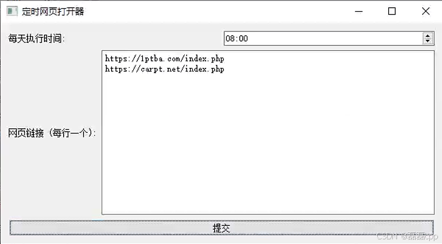

# PTAutomaticCheck-in

PT站点自动签到

每天定时默认打开msedge，指定多个网页，根据油猴插件自动签到，之后关闭浏览器。

js文件夹下
“PT签到-1.2.0.user.js”
导入油猴即可

20250511
发现现在有时候虽然执行了一次，但是有打卡不上的情况，比如服务器有问题，导致签到失败。
故：添加一次重试机制。
打包：pyinstaller -F -w TimeStartbat.py